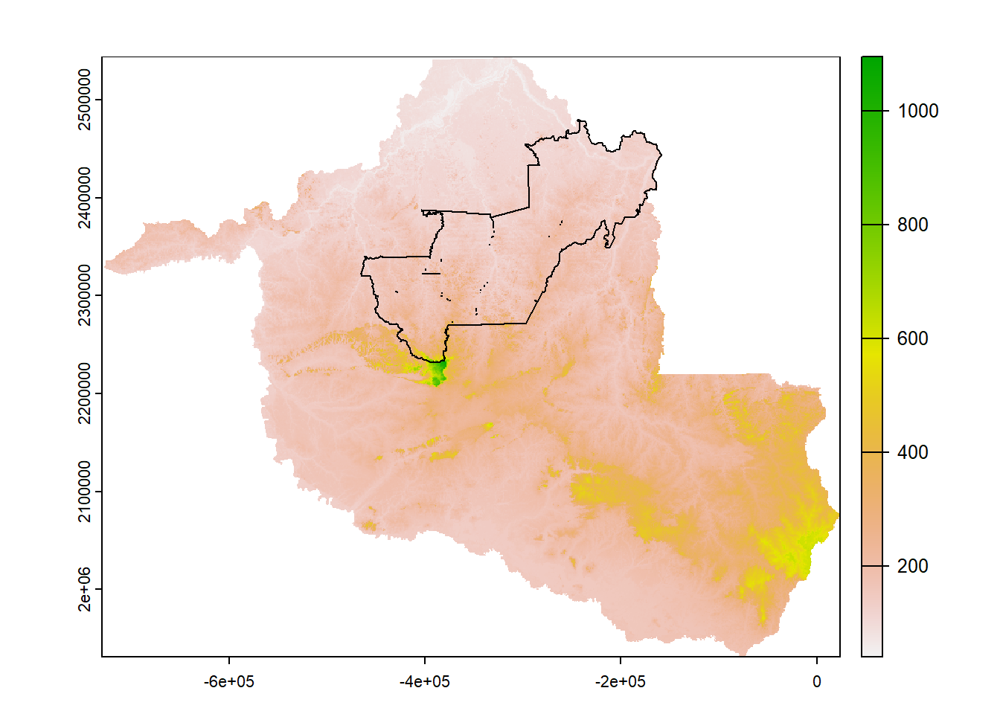
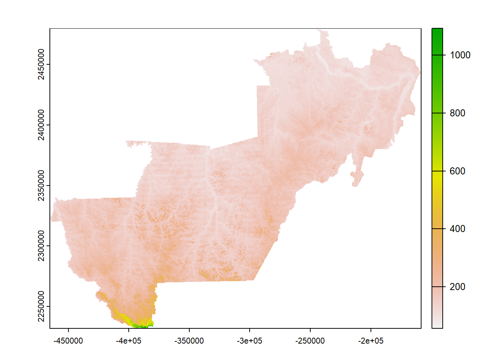

## Loading packages
```{r message=FALSE, warning=FALSE}
pkg <- c("terra", "dplyr", "sf")

sapply(pkg, require, character.only = T)
```


## Cleaning the environment (removing objects and previously loaded packages)
```{r}
rm(list = ls())  
gc()
```


## Loading the DEM and cropping it to the study area
```{r}
ter <- st_read("./vect/ro_territorio.shp") %>% 
  st_transform(crs = "ESRI:102015") %>% 
  group_by(territr) %>% 
  summarize() %>% 
  filter(territr == "Vale do Jamari") %>% 
  vect()


dem <- rast("./predictors/dem/dem.tif") 


plot(dem)

plot(ter, add = T)
```


<p align="center">

</p>


```{r}
dem <- dem %>% 
  crop(ter) %>% 
  mask(ter)

plot(dem)
```

<p align="center">

</p>

## Deriving the morphometric variables
```{r eval=FALSE, include=TRUE}
source("./scripts/s_fmorpho.R")


morfometricas_saga(dem = dem,
                   outdir = "./predictors/morpho/",
                   align_rasters = T,
                   sol_rad = T,
                   start_date = "01/01/2022",
                   end_date = "12/31/2022",
                   verbose = T,
                   parallel = T,
                   cores = 15)
```
